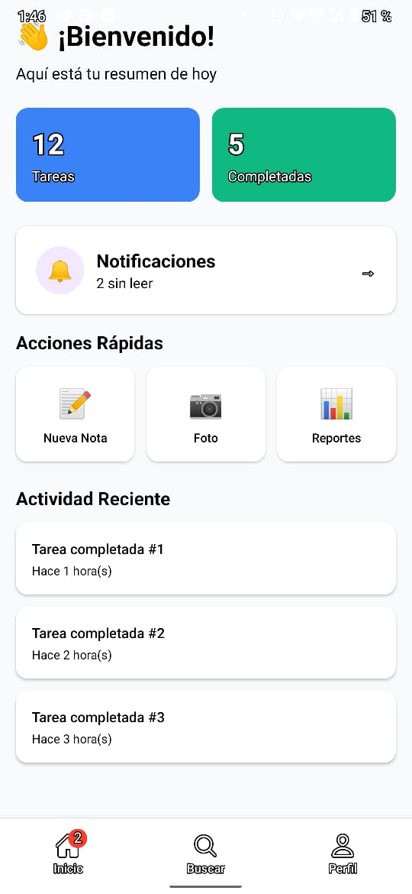
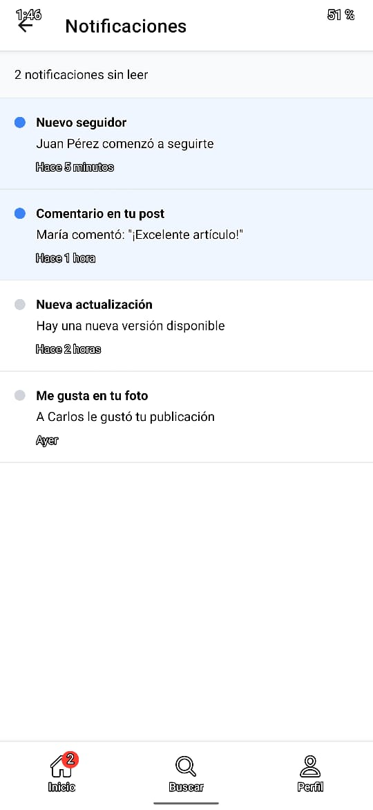
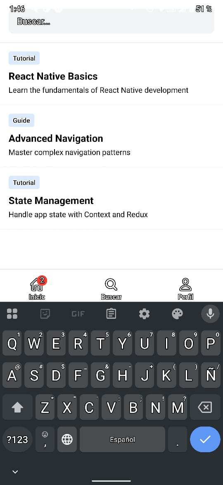
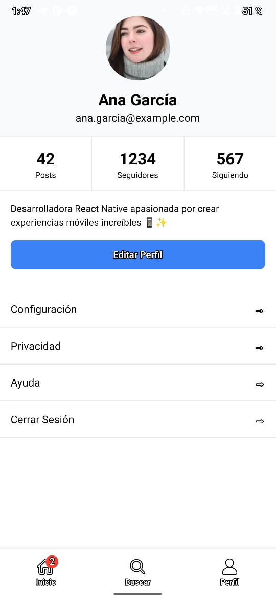
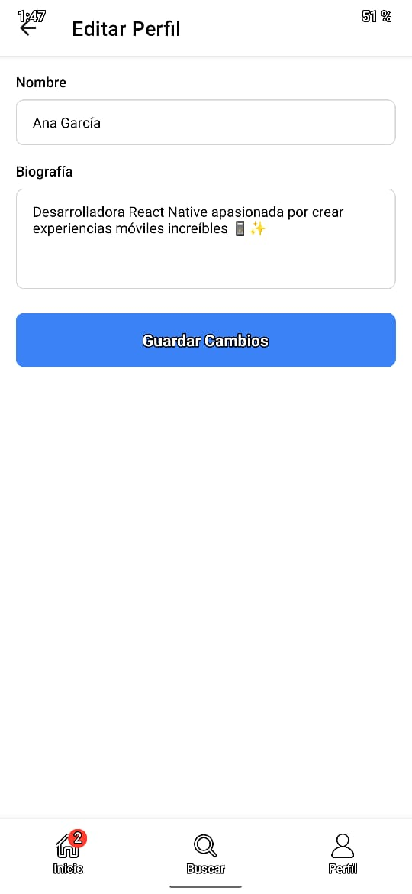

# 📱 Práctica 2: Dashboard App con Tab Navigator

**👤 Autor:** Miguel Lopez  
**📅 Fecha:** 23 de octubre de 2025  
**📚 Curso:** Semana 2 - Navegación React Native

## 🎯 Objetivo
Crear una aplicación de dashboard que demuestre el uso de **Tab Navigator** con stacks anidados, íconos personalizados y badges de notificación.

## 🏗️ Arquitectura de Navegación

```
TabNavigator (Principal)
├── HomeTab → HomeStack
│   ├── HomeScreen (Dashboard)
│   └── NotificationsScreen
├── SearchTab → SearchScreen (Pantalla simple)
└── ProfileTab → ProfileStack  
    ├── ProfileScreen
    └── EditProfileScreen
```

## 📁 Estructura del Proyecto

```
practica-2-dashboard-app/
├── src/
│   ├── screens/
│   │   ├── home/
│   │   │   ├── HomeScreen.tsx
│   │   │   └── NotificationsScreen.tsx
│   │   ├── search/
│   │   │   └── SearchScreen.tsx
│   │   └── profile/
│   │       ├── ProfileScreen.tsx
│   │       └── EditProfileScreen.tsx
│   ├── navigation/
│   │   ├── TabNavigator.tsx
│   │   ├── types.ts
│   │   └── stacks/
│   │       ├── HomeStack.tsx
│   │       └── ProfileStack.tsx
│   └── data/
│       └── mockData.ts
├── App.tsx
└── screenshots/                   # Capturas de pantalla (practica-2-dashboard-app/screenshots/)
    ├── practica_2.1.jpg
    ├── practica_2.2.jpg
    ├── practica_2.3.jpg
    ├── practica_2.4.jpg
    └── practica_2.5.jpg
```

## 🚀 Características Implementadas

### ✅ Tab Navigator Principal
- **3 Tabs**: Home, Search, Profile
- **Íconos Ionicons**: Cambian según el estado (focused/unfocused)
- **Badge de notificaciones**: En tab Home muestra conteo de notificaciones no leídas
- **Styling personalizado**: Colores, altura y tipografía

### ✅ HomeStack (Navegación Anidada)
- **HomeScreen**: Dashboard con estadísticas y widgets
- **NotificationsScreen**: Lista de notificaciones con badges

### ✅ ProfileStack (Navegación Anidada)  
- **ProfileScreen**: Perfil de usuario con estadísticas
- **EditProfileScreen**: Formulario para editar perfil

### ✅ SearchScreen (Pantalla Simple)
- **Búsqueda**: Con filtros por categoría
- **Resultados**: Lista de elementos encontrados

## 🔧 Tecnologías Utilizadas

- **React Native**: 0.81.5
- **Expo**: 54.0.19
- **React Navigation v6**:
  - `@react-navigation/native`
  - `@react-navigation/bottom-tabs`
  - `@react-navigation/native-stack`
- **TypeScript**: Tipado estricto para navegación
- **Expo Vector Icons**: Íconos Ionicons para tabs
- **pnpm**: Gestor de paquetes

## 🎨 Características de UI/UX

### 🏠 HomeScreen (Dashboard)
- **Cards de estadísticas**: Posts, Followers, Views
- **Widgets interactivos**: Acceso rápido a funciones
- **Navegación**: Botón para ir a notificaciones

### 🔔 NotificationsScreen
- **Lista de notificaciones**: Con timestamps y estado read/unread
- **Badges visuales**: Indicadores de notificaciones nuevas
- **Diseño limpio**: Separación clara entre elementos

### 🔍 SearchScreen  
- **Barra de búsqueda**: Input con placeholder
- **Filtros**: Botones por categoría (Tutorial, Guía, Ejemplo)
- **Resultados**: Cards con título, categoría y descripción

### 👤 ProfileScreen
- **Avatar y datos**: Imagen, nombre, email, bio
- **Estadísticas**: Posts, followers, following
- **Acciones**: Botón para editar perfil

### ✏️ EditProfileScreen
- **Formulario completo**: Nombre, email, bio
- **Validación**: Campos requeridos
- **Acciones**: Guardar y cancelar

## 🎯 Conceptos de React Navigation Demostrados

### 1. **Bottom Tab Navigator**
```typescript
const Tab = createBottomTabNavigator<TabParamList>()
```

### 2. **Navegación Anidada (Nested Navigation)**
```typescript
// Tab contiene Stacks, Stacks contienen Screens
TabNavigator → HomeStack → HomeScreen/NotificationsScreen
```

### 3. **Íconos Dinámicos**
```typescript
tabBarIcon: ({ focused, color, size }) => {
  const iconName = focused ? 'home' : 'home-outline'
  return <Ionicons name={iconName} size={size} color={color} />
}
```

### 4. **Badges en Tabs**
```typescript
tabBarBadge: unreadCount > 0 ? unreadCount : undefined
```

### 5. **Tipado TypeScript**
```typescript
export type TabParamList = {
  HomeTab: undefined
  SearchTab: undefined  
  ProfileTab: undefined
}
```

## 🏃‍♂️ Cómo Ejecutar

```bash
# Navegar al proyecto
cd practica-2-dashboard-app

# Instalar dependencias
pnpm install

# Iniciar servidor de desarrollo  
pnpm start

# Escanear QR con Expo Go o usar simulador
```

## 📸 Screenshots

### 🏠 Home Dashboard

*Dashboard principal con estadísticas y widgets de acceso rápido*

### 🔔 Notificaciones  

*Lista de notificaciones con badges y timestamps*

### 🔍 Búsqueda

*Pantalla de búsqueda con filtros por categoría*

### 👤 Perfil

*Perfil de usuario con estadísticas y acciones*

### ✏️ Editar Perfil

*Formulario para actualizar información del perfil*

## 🎓 Aprendizajes Clave

1. **Tab Navigation**: Navegación principal de la app
2. **Nested Navigation**: Stacks dentro de tabs
3. **Iconografía**: Íconos dinámicos según estado
4. **Badges**: Indicadores visuales de notificaciones
5. **TypeScript**: Tipado fuerte para navegación
6. **UX Patterns**: Patrones comunes de apps móviles

## 📝 Próximos Pasos

- ✅ **Práctica 1**: Stack Navigator (Blog App) - COMPLETADA
- ✅ **Práctica 2**: Tab Navigator (Dashboard App) - COMPLETADA  
- ⏳ **Práctica 3**: Drawer Navigator (Settings App) - PENDIENTE

---

**Desarrollado por:** Miguel Lopez  
**Fecha:** 23 de octubre de 2025  
**Propósito:** Aprender React Navigation v6 - Tab Navigator con navegación anidada